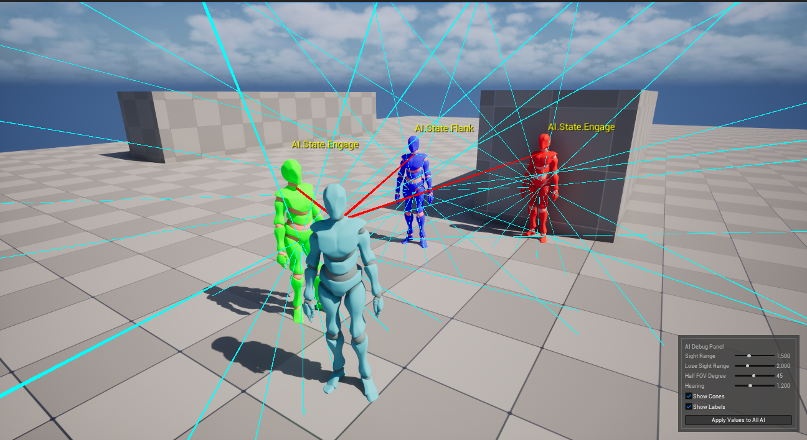
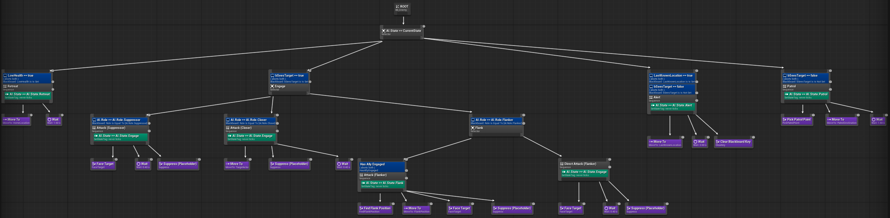
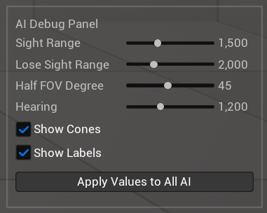

# Tactical AI Showcase

A small playable encounter in Unreal Engine 5.7. Three enemy roles coordinate against the player through perception stimuli and a shared world subsystem. Built end-to-end in C++ on AI Perception, Behavior Trees, EQS, and World Subsystems.

Blueprint is used only for default values, the Behavior Tree graph asset, and Input Action bindings.

## The Encounter

Three enemies in a room with a fixed role each. The player navigates around them, evades, or breaks the formation. Coordination happens through perception stimuli (sight, hearing, damage) and the squad subsystem reading and writing shared state.

## Roles

**Suppressor**. Stays at its starting position. Faces the player and starts firing immediately.

**Closer**. Moves towards the player through NavMesh navigation, then fires on arrival.

**Flanker**. Arcs around the player to a position scored by EQS, but only when an ally is already engaging (gated by the `HasAllyEngaged` decorator). Alone, falls back to a Direct Attack from its current position. The decorator's tick flips back to Flank the moment an ally enters Engage or Flank state.

## Systems

**AI Perception**. Sight, hearing, and damage senses on every enemy. Sight uses `AutoSuccessRangeFromLastSeenLocation` so brief FOV slips don't drop the target. Hearing detects player footsteps emitted on a timer. Damage is wired but no system writes to it yet.

**Squad coordination**. `USquadSubsystem` (a `UWorldSubsystem`) holds a flat array of registered allies with role tag, current state tag, and current target. AI controllers register in `OnPossess` and unregister in `OnUnPossess`. The `HasAllyEngaged` decorator polls the array and aborts the Flanker's lower-priority branch when the engaged count crosses 1.

**Behavior Tree**. State Selector at the top (Retreat, Engage, Alert, Patrol). Engage contains role dispatch. Three sibling branches gated by role tag (Suppressor, Closer, Flanker). The Flanker branch holds a sub-selector for the flank-or-fallback decision. Every attack branch terminates in `BTTask_Suppress`, the shared fire action used by all roles.

**Gunfire as a hearing stimulus**. Each Suppress shot calls `UAISense_Hearing::ReportNoiseEvent` at the player's location with the player as the instigator. AI within hearing range pick the noise up through `bDetectEnemies`, write `LastKnownLocation`, and walk Alert toward it.

**Save and load**. `UTacticalAISaveGame` extends `USaveGame` with a schema version stamped on every save. F5 saves to the Quick slot, F9 loads. `MigrateIfNeeded` is set up to walk old saves forward through version checks when the schema changes.

**Stealth**. The player emits hearing stimuli on a timer while moving. Crouching cuts the loudness from `WalkNoiseLoudness` to `CrouchNoiseLoudness` so the AI's effective hearing range shrinks. Standing still emits no noise.

**Runtime debug panel**. Slate widget anchored to the bottom-right of the viewport. Sliders write to `UAIDebugSettings::Pending*` fields live. The Apply button calls `ApplyDebugSettings` on every live `AEnemyAIController`, which pushes the values into the sense configs and triggers `RequestStimuliListenerUpdate`.

## Tech stack

| Component | Choice |
|---|---|
| Engine | Unreal Engine 5.7 |
| Language | C++ (Blueprint for default values, BT graph, and Input Actions only) |
| Platform | Windows |
| IDE | Visual Studio 2022 |
| Input | Enhanced Input |
| AI | AIModule, GameplayTasks, NavigationSystem, EQS |
| Tags | NativeGameplayTags |
| UI | Slate (debug panel) |

## Build

1. Install Unreal Engine 5.7 from the Epic Games Launcher.
2. Install Visual Studio 2022 with the "Game development with C++" workload.
3. Clone the repository.
4. Right-click `TacticalAIShowcase.uproject` and choose "Generate Visual Studio project files".
5. Open `TacticalAIShowcase.sln` in Visual Studio and build with the Development Editor target.
6. Open the project, and press Play.

## Controls

| Key | Gamepad | Action |
|---|---|---|
| WASD | Left thumbstick | Move |
| Mouse | Right thumbstick | Look |
| Space | A | Jump |
| C / Ctrl | X | Toggle crouch |
| F5 | LB | Save to Quick slot |
| F9 | RB | Load Quick slot |

## What is out of scope

Health and damage are placeholders. A real attribute system (GAS or otherwise) would replace the stand-in values.

No production audio, no animations beyond the default Mixamo BOT characters and simple locomotion, no real projectiles. Debug lines and timing beats stand in for what would be montages and VFX in a shipping version.

Save and load pair enemies to snapshots by `TActorIterator` order, which is fragile to level edits. Stable per-actor identifiers would replace this in a shipping version.

## License

This project is licensed under the MIT License. See `LICENSE` for details. Character meshes and animations come from Mixamo (Adobe) under Mixamo's royalty-free terms. Any default Unreal Engine content remains under the Unreal Engine EULA. See `NOTICE.md` for the full third-party attribution.
